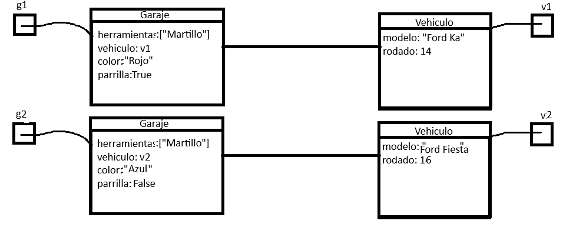
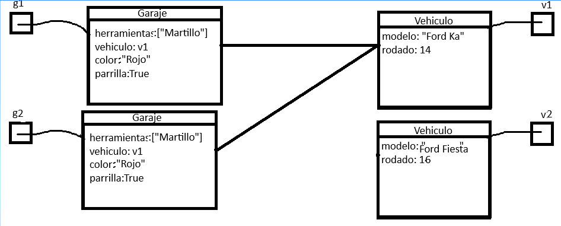
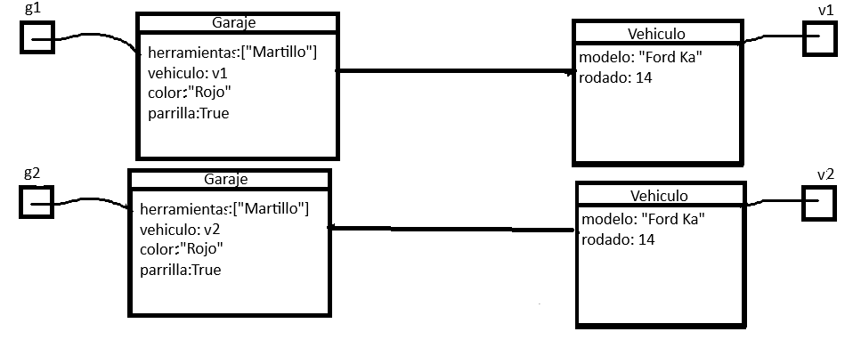

# EJERCICIO 10.

## • Explicá la diferencia entre copy superficial y en profundidad, proponé un ejemplo simple y 
## un diagrama de objetos para ilustrar esta diferencia.

La diferencia entre la copia superficial y en profundidad la podemos demostrar en la asociacion, ya que al tener un atributo de instancia de clase, al hacer el copy superficial copiamos la referencia a este objeto quedando ligado al mismo objeto que el original, copiando la referencia. Por otro lado, el copy en profundidad, modifica el objeto ligado dejandolo igual al objeto copiado.

Un ejemplo:
Dado los siguientes objetos:

- En el copy en superficial quedaria asi:

- En el copy en profundidad quedaria asi:

## • De manera similar, explicá la diferencia entre equals superficial y en profundidad, utilizando un
## ejemplo simple y un diagrama de objetos para clarificar la distinción.

## • Describa las relaciones de dependencia y asociación entre clases. Muestre las dos relaciones en un
## único ejemplo ilustrativo de su utilidad.
